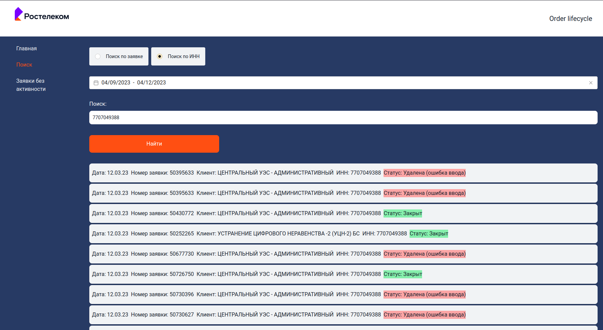

#  Hackathon Application Life Case

[-white?style=for-the-badge&logo=django&logoColor=black)](https://www.djangoproject.com/)

### All installation instructions are inside the [next directory](https://github.com/socloseeee/django_hack_app_life/tree/master/django_hack_app_life)

### Result([Frontend repo](https://github.com/neketli/order-lifecycle/tree/master/frontend)):

